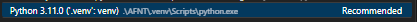
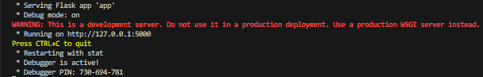

### To run the AFNT App:
1. Open Visual Studio Code or any other IDE.
2. Select the AFNT directory.
3. Activate the `.venv` virtual environment as the Python environment. 
   
4. Open the `AFNT.py` file located in `\AFNT\Application\AFNT.py`.
5. Run the file.
6. Enjoy!

### To run the Admin Management Website:
1. Open Visual Studio Code or any other IDE.
2. Select the AFNT directory.
3. Activate the `.venv` virtual environment as the Python environment. 

4. Open the `app.py` file located in `AFNT\app.py`.
5. Run the file.
6. Copy the URL shown in the terminal, and paste it into your browser's address bar.
   
7. Enjoy!